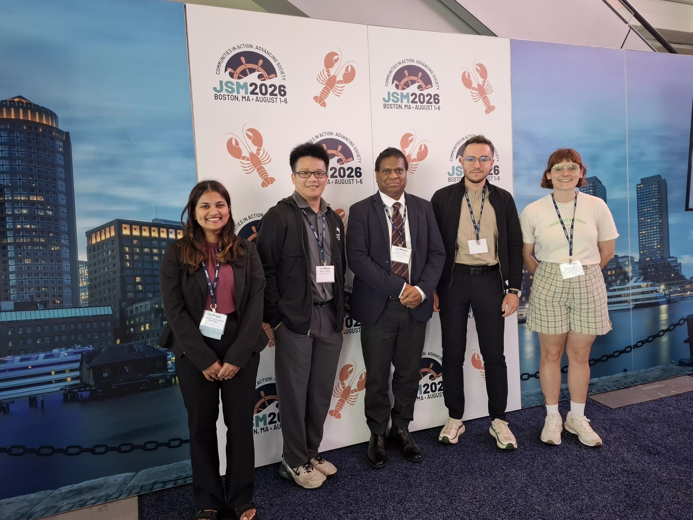
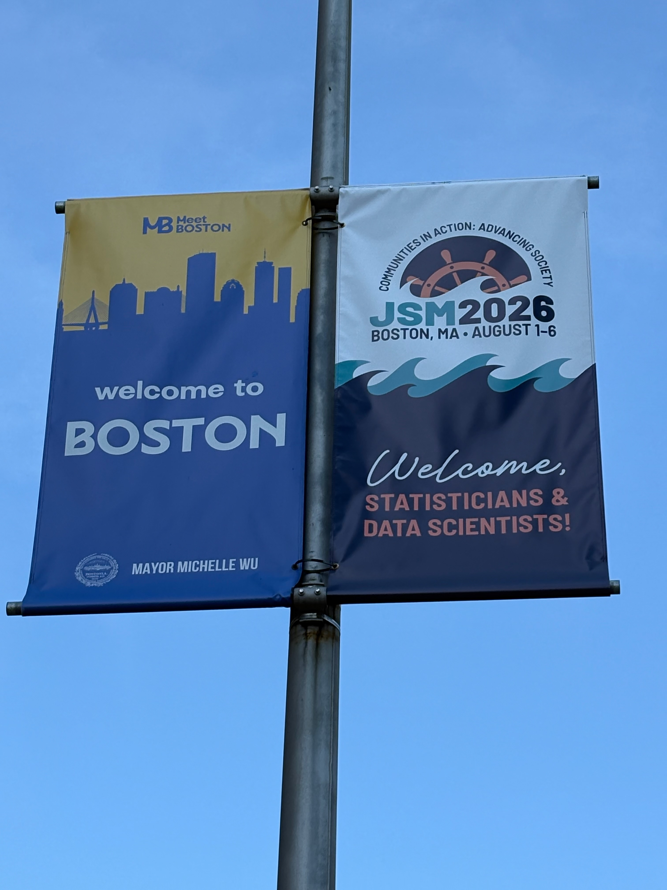

Between August 1 and 6, Adam Struzik was taking part in the Joint Statistical Meetings 2026 Conference in Boston, Massachusetts, USA. The event gathered over 5,000 attendees from all over the world.

Adam Struzik gave a presentation entitled "Capturing Small Discrepancies in Record Linkage: A Maximum Entropy Framework with Continuous Similarity Measures". The talk took place in the "Student Paper Award and John M. Chambers Statistical Software Award" session and was a part of the award in the Student Paper Competition organized by the ASA Section on Statistical Computing and ASA Section on Statistical Graphics. The methods described in the competition paper are implemented in the [`automatedRecLin`](https://cran.r-project.org/package=automatedRecLin) R package.

Additionally, Adam Struzik took part in a roundtable discussion entitled "Linking the Future: What’s Next for Record Linkage and Entity Resolution". During the meeting, researchers examined the newest methods and challenges for entity resolution problems.

{width="50%" fig-align="center"}

{width="50%" fig-align="center"}

{width="50%" fig-align="center"}

{width="50%" fig-align="center"}
